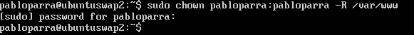
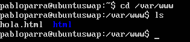
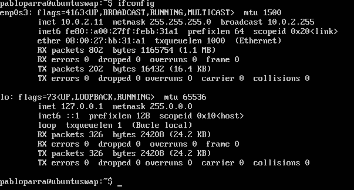
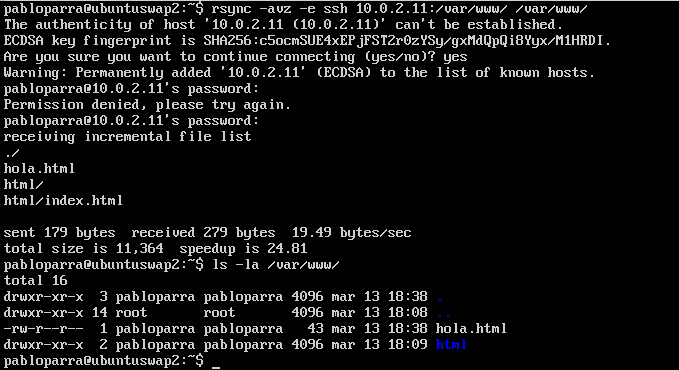
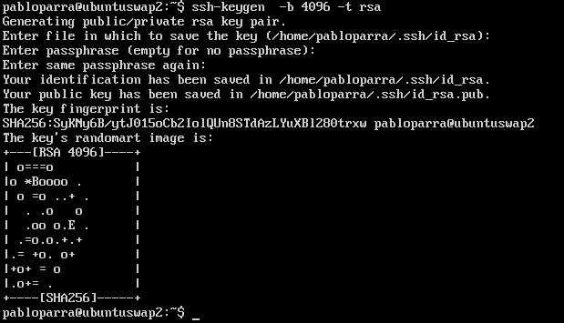
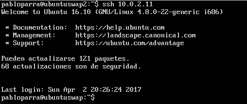
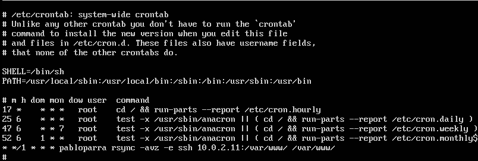

#SWAP    Práctica 2
En esta práctica llevaremos a cabo las siguientes tareas:

###1. Probar el funcionamiento de la copia de archivos por ssh
###2. Clonado de una carpeta entre las dos máquinas
###3. Configuración de ssh para acceder sin que solicite contraseña
###4. Establecer una tarea en cron que se ejecute cada hora para mantener actualizado el contenido del directorio /var/www entre las dos máquinas

###1 y 2

Para realizar una copia de archivos por ssh utilizaremos la herramienta rsync la cual nos permite la sincronización
de archivos entre dos máquinas en una misma red. Yo he trabajado sobre el usuario normal sin privilegios 
(pabloparra en mis máquinas) por lo que tendre que darle permisos a la carpeta que vamos a clonar "/var/www/", lo
hacemos de la siguiente forma:

Ya dados los permisos al usuario sobre la carpeta que queremos clonar, procedemos al clonado de la carpeta 
"/var/www/" que se encuentra en la máquina1 (ubuntuswap) a la máquina2 (ubuntuswap2).
En la siguiente imagen veremos los archivos que tengo inicialmente en la máquina1.

Utilizaremos el comando "ifconfig" para comprobar la ip de la máquina1:

Para clonarlos haremos uso del comando rsync tal y como nos ayuda el guión de la práctica. Lo vemos:

###3

Ahora nos centraremos en configurar ssh de manera que podamos acceder desde la máquina1 a la máquina2 por ssh sin
que nos pida la contraseña de la máquina a la que nos queremos conectar.
Para poder acceder a la consola remota sin tener que introducir una contraseña, necesitamos una llave. Esta se
puede hacer con ssh-keygen. En concreto, ssh puede crear llaves de tipo RSA y DSA. Utilizaremos una RSA puesto que 
es más segura, con la opción -t se lo indicamos:

Ya hemos generado la clave, ahora nos disponemos a copiarla en la máquina en la que nos queremos conectar, lo
haremos con el comando "ssh-copy-id"

A partir de ahora no nos pedirá ya la contraseña cuando nos conectemos por ssh, lo comprobamos:

###4 

Para este ejercicio haremos uso del "cron" que es un administrador de procesos que actua en segundo plano y los 
ejecuta en los intervalos que nosotros le indiquemos, para crear nuestra tarea, debemos editar el archivo
"/etc/crontab" como superusuario. Para indicar el intervalo en el cual se ejecutará la tarea, tenemos varios 
campos:

* Minuto
* Hora
* DiadelMes
* Mes
* DiadelaSemana
* Usuario
* Comando

Como en nuestro caso, yo quiero que se ejecute cada 1 Hora, rellenaremos ese campo, el de usuario y el comando (el
que utilizamos para copiar las carpetas), podemos ver el archivo crontab modificado:

