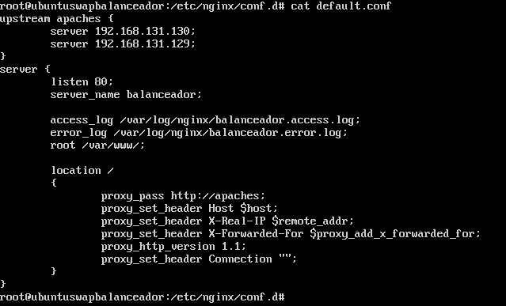
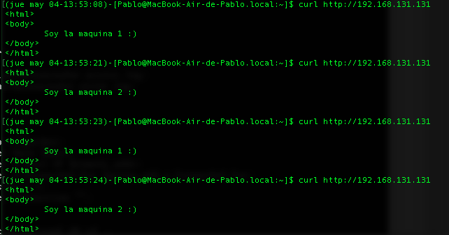
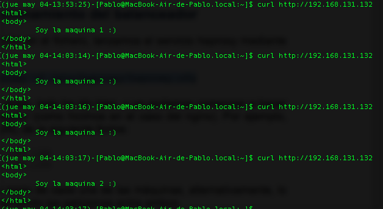
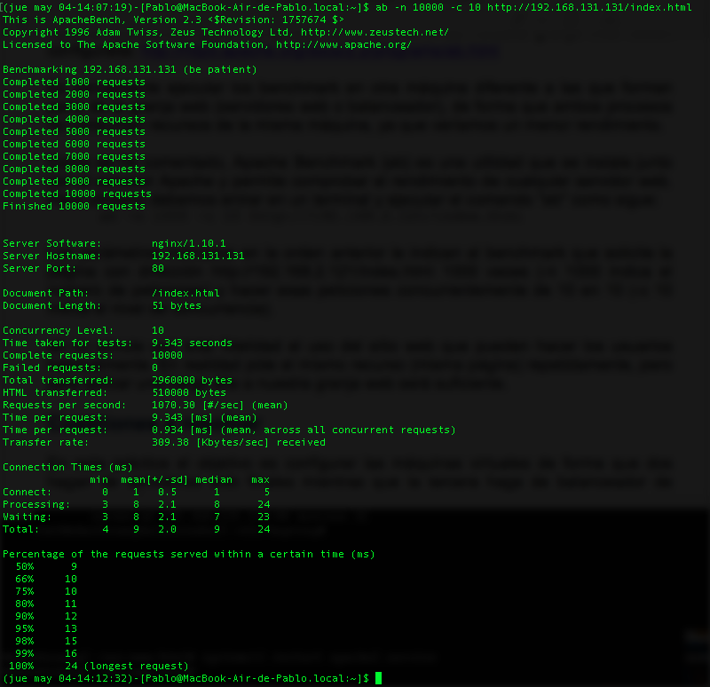
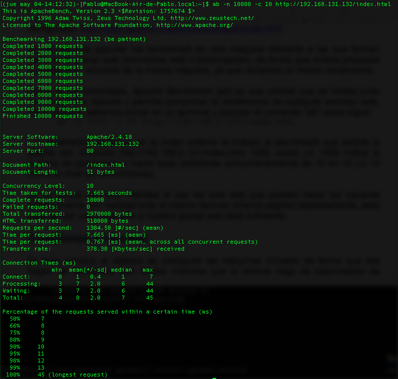

# Práctica 3 - SWAP
### En esta práctica se llevarán a cabo, como mínimo, las siguientes tareas:
### 1. configurar una máquina e instalarle el nginx como balanceador de carga
### 2. configurar una máquina e instalarle el haproxy como balanceador de carga
### 3. someter a la granja web a una alta carga, teniendo primero nginx y después haproxy.

Para llevarla a cabo debemos crearnos 2 máquinas virtuales nuevas para que actuen como balanceadores de carga, una de ellas tendra instalado nginx y la otra haproxy. A estas máquinas no debemos instalarle Apache ya que se apoderaría del puerto 80 el cual necesitamos para recibir las peticiones HTTP desde fuera del balanceador.

Procedemos a la instalación de nginx en la primera máquina cuya dirección es la siguiente:

Instalamos nginx con el comando:

```bash
sudo apt-get install nginx
```
Una vez instalado el balaceador, debemos configurarlo para que haga peticiones a las máquinas servidoras. Para ello debemos modificar el archivo de configuración que se encuentra en:

```bash
/etc/nginx/conf.d/default.conf
```
Mi configuración es la siguiente:

(Si nos damos cuenta las direcciones de las máquinas han cambiado con respecto a la práctica 2, esto se debe a que yo inicialmente tenía las máquinas en VirtualBox pero me ha dado problemas y he creado máquinas nuevas en VMWare).
Con solo poner esta configuración en una primera instacia debería de balancear la peticiones pero nos damos cuenta de que si hacemos peticiones curl a la dirección del balanceador de carga nos devuelve un html de nginx de la máquina balanceadora, por lo que no esta preparado todavía, debemos borrar un archivo de configuración por defecto que aparece en la carpeta:

```bash
/etc/nginx/sites-enabled/default
```
Una vez borrado inicializaremos el servicio con:

```bash
systemctl start nginx
```
y desde la máquina anfitriona haremos peticiones a la dirección: 192.168.131.131, lo vemos:


De la misma forma que creamos la máquina balanceadora para nginx, creamos una ahora para configurarla con el balaceador haproxy. La nueva máquina tiene la siguiente configuración:

Instalamos haproxy con el comando:

```bash
sudo apt-get install haproxy
```

Una vez instalado lo configuraremos modificando el fichero de configuración:

```bash
/etc/haproxy/haproxy.cfg
```
Mi configuración es la siguiente:


Ponemos en marcha el balanceador con el siguiente comando:

```bash
sudo /usr/sbin/haproxy -f /etc/haproxy/haproxy.cfg
```
Y ya podemos desde la máquina anfitriona hacer peticiones a la dirección: 192.168.131.132, lo vemos:



Como podemos comprobar funciona correctamente, ahora procederemos a someterlo a una alta carga de trabajo y vemos como responde, para ello haremos uso del comando ab.

Comenzaremos con el balanceador nginx:



Y continuaremos con haproxy:



Como podemos ver, haproxy nos da mejores resultados ya que esta más orientado a ofrecernos altas prestaciones a la hora de balancear carga.