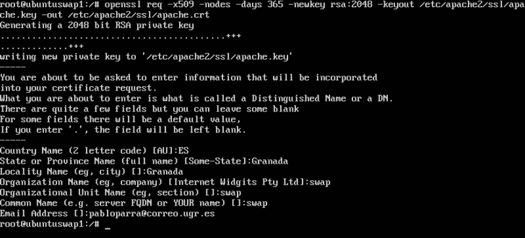
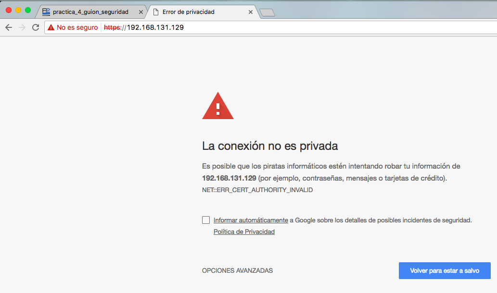
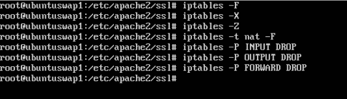
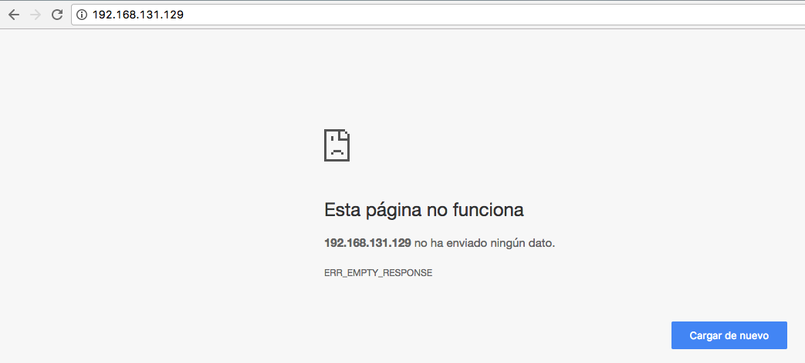
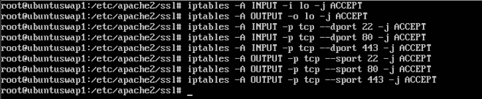
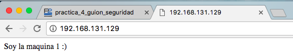
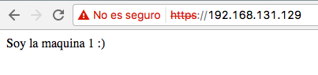

# Práctica 4  - SWAD
### El objetivo de esta práctica es configurar todos los aspectos relativos a la seguridad de la granja web ya creada.
### Llevaremos a cabo las siguientes tareas:
### 1. Instalar un certificado SSL autofirmado para configurar el acceso HTTPS a los servidores. 
### 2.Para la segunda parte configuraremos las reglas del cortafuegos iptables para asegurar el acceso a los servidores web, permitiendo el acceso por los puertos de HTTP y HTTPS.


Estas configuraciones la realizare en mi máquina virtual SWAP_1 de ip: 192.168.131.129
En esta primera parte instalaremos un certificado SSL para dar, al servicio web que ofrecemos, seguridad firmada por nosotros mismos. De esta forma le decimos al visitante o consumidor que puede tener plena confianza en nuestro servicio.

Activamos el módulo SSL de apache, generamos los certificados e indicamos la ruta de los certificados. También debemos crear la carpeta ssl en el directorio /etc/apache, donde alojaremos los certificados. Ejecutamos los siguientes comandos: 

```bash
a2enmod ssl
service apache2 restart
mkdir /etc/apache2/ssl
openssl req -x509 -nodes -days 365 -newkey rsa:2048 -keyout /etc/apache2/ssl/apache.key -out /etc/apache2/ssl/apache.crt
```
Utilizamos a2enmod para activar el módulo SSL y reiniciamos el servicio apache, creamos la carpeta y generamos los certificados. Con el último comando estamos creando unos certificados validos para 1 año, que van a estar alojados en la carpeta creada previamente, la clave va a estar cifrada con el algoritmo RSA de 2084 bytes y con la opción -nodes decimos que no vamos a encriptar con DES (Data Encryption Standard).

Una vez ejecutado el comando nos pedirá que rellenos una serie de datos para que indiquemos donde se encuentra nuestro dominio. Lo rellenamos: 


Para finalizar editaremos la configuración por defecto de ssl (/etc/apache2/sites-available/default-ssl) y justo debajo de  "SSLEngine on" le indicamos donde esta el certificado con su clave, añadimos las siguiente lineas:

```bash
SSLCertificateFile /etc/apache2/ssl/apache.crt
SSLCertificateKeyFile /etc/apache2/ssl/apache.key
```

Ya podremos acceder a nuestro servicio por HTTP y por HTTPS, al ser un certificado autofirmado nos dirá que no es seguro, deberemos de aceptar las condiciones y ya podremos acceder.




Para la segunda parte configuraremos el cortafuegos mediante iptables, de forma inicial pondremos el cortafuegos que no acepte ningun tipo de tráfico y luego que acepte las peticiones entrantes y salientes por los puertos 80 y 443 (https).

Borramos toda configuración previa y cerramos tráfico:



Probamos ahora a acceder al servicio y comprobamos que nos lo da:



Abrimos ahora las conexiones configurando iptables de la siguiente manera:



Probamos ahora a conectarnos por HTTP y no tenemos ningun problema:



Ahora por HTTPS



Para finalizar la práctica hemos realizado un script con la secuencia de comandos anterior y la hemos guardado en el archivo:

```bash
/etc/rc.local
```
Para que se ejecute cada vez que arranque la máquina.