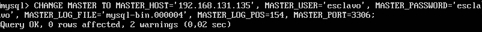

# Práctica 5 - Replicación de bases de datos MySQL
### Los objetivos de esta práctica son:
### 1. Crear una BD con al menos una tabla y algunos datos.
### 2. Realizar la copia de seguridad de la BD completa usando mysqldump.
### 3. Restaurar dicha copia en la segunda máquina (clonado manual de la BD).
### 4. Realizar la configuración maestro-esclavo de los servidores MySQL para que la replicación de datos se realice automáticamente.

Para la realización de esta máquina necesitamos dos máquinas  virtuales, en mi caso utilizare las máquina: SWAP\_1 (192.168.131.135) y SWAP\_2 (192.168.131.130).


1 - Crearemos la base de datos con mysql, para ello entramos en este sistema de gestión con el comando:

```bash
mysql -u root -p
```
Nos pedirá la contraseña, la introducimos y ya estaremos preparados para crear las bases de datos. Ya dentro podemos crear nuestra base de datos con

```bash
mysql> create database <nombre_BD>
```
En mi caso la llamaré "contactos". La seleccionamos con:

```bash
mysql> use contactos;
```
Le indicamos que datos va a almacenar, en mi caso pares nombre-telefono con:

```bash
create table datos(nombre varchar(100), tlf int);
```
E insertaremos datos con:

```bash
insert into datos(nombre,tlf) values("pablo",958123123);
```
y mostramos el contenido de datos con:

```bash
select * from datos;
```
En mi caso he hecho ya varias inserciones por lo que tengo más datos pero se puede ver claramente que la salida es la esperada: 


2 - Para realizar la copia de seguridad de la base de datos, utilizaremos mysqldump, el siguiente comando que nos almacenará la copia en el la carpeta /root.

```bash
mysqldump contactos -u root -p  > /root/contactos.sql
```

3 - Para esta tercera parte queremos enviar esta copia a la otra máquina y que esta la restaure. Ahora desde la segunda máquina ejecutaremos el comando para copias de archivos entre máquinas: scp
 
 ```bash
 scp 192.168.131.130:/root/contactos.sql /root/
 ```
 Ya tendremos en el directorio root de nuestra máquina SWAP\_2 la base de datos replicada "contactos". Para poder utilizarla en la segunda máquina debemos crear primero la base de datos que lo haremos de la misma forma que la creamos en SWAP\_1, salimos de mysql y asociamos la base de datos vacia (por ahora), con la copia que tenemos en /root.
 
```bash
mysql -u root -p contactos < /root/contactos.
```

En este punto ya tenemos las dos bases de datos iguales en las dos máquinas pero lo que en realidad queremos es que al modificar en una cambie también en la otra lo que nos lleva al siguiente punto. 

4 - Para esta ultima parte debemos cambiar la configuración (de las dos máquinas)que aparezca en el archivo /etc/mysql/mysql.conf.d/mysqld.cnf y cambiar la siguientes lineas: 
```bash
\# bind-access 127.0.0.1 --> la comentamos
```
```bash
log_error = /var/log/mysql/error.log --> La descomentamos
```

```bash
sercer-id = 1 --> La descomentamos (el valor será 2 en el caso de la otra máquina).
```
```bash
log_bin= / var/log/mysql/bin.log --> Lo descomentamos
```

Luego reiniciaremos el servicio y ahora configuraremos el mysql del maestro:

Entramos en mysql y ponemos los siguientes comandos:

```bash
mysql> CREATE USER esclavo IDENTIFIED BY 'esclavo';
```
```bash
mysql> GRANT REPLICATION SLAVE ON *.* TO 'esclavo'@'%' IDENTIFIED BY 'esclavo';
```
```bash
mysql> FLUSH PRIVILEGES;
```
```bash
mysql> FLUSH TABLES;
```
```bash
mysql> FLUSH TABLES WITH READ LOCK;
```
Ahora vemos los datos de la base de datos que nos harán falta para replicarla en la máquina esclava:
```bash
mysql>  SHOW MASTER STATUS;
```


Ahora en la máquina esclavo en mysql pondremos:
Debo decir que hice esta captura antes que la anterior y el dia que pensaba presentar la práctica tuve que crearme una máquina nueva por lo que en el comando correctamente deberia de poner "mysql-bin.000007" por lo demás todo igual.


Para que se repliquen los datos ponemos: 

```bash
mysql> START SLAVE;
```
Desbloqueamos las tablas para que puedan ser modificadas con:
```bash
mysql> UNLOCK TABLES;
```

Para asegurarnos de que todo esta correctamente configurado ponemos el siguiente comando y si la variable “Seconds\_Behind\_Master” es distinta de “null” es que esta bien configurado. 


Ya podemos modificar las bases de datos en una máquina que se replicará en la otra.
