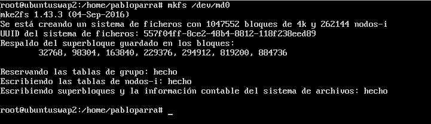
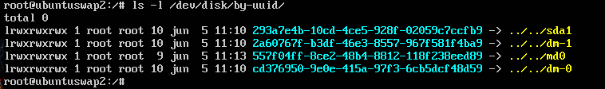
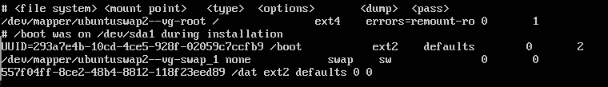
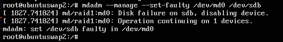
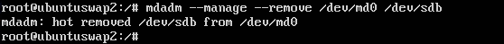
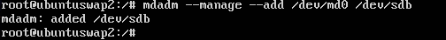
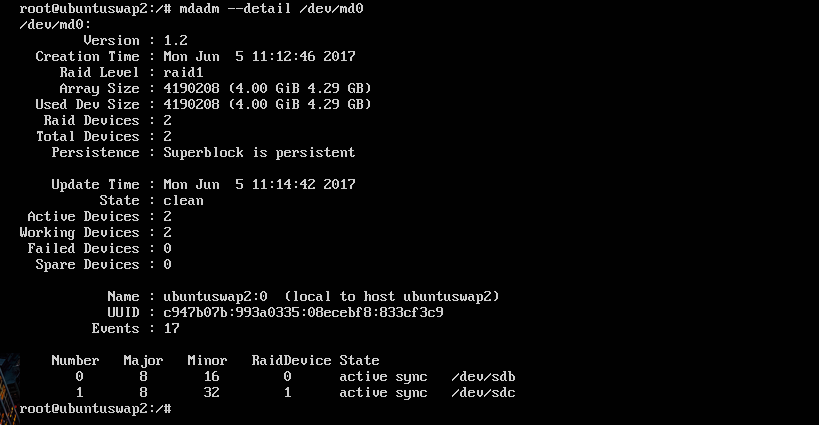

# Práctica 6 - Discos en RAID
### En esta práctica configuraremos dos discos en RAID 1 por software, usando una maquina virtual con Ubuntu server. Esta configuración RAID ofrece una gran seguridad al replicar los datos en los dos discos.
### 1. realizar la configuración de dos discos en RAID 1 bajo Ubuntu.
### 2. Simular un fallo en uno de los discos del RAID (mediante comandos con el mdadm), retirarlo “en caliente”, comprobar que se puede acceder a la información que hay almacenada en el RAID, y por último, añadirlo al conjunto y comprobar que se reconstruye correctamente.

Para la realización de esta práctica nos bastará un utilizar una sola máquina virtual. Tendremos que añadirle dos discos nuevos para configurarlos como RAID, para ello nos vamos a la configuración de la máquina y los añadimos.
Instalamos el software necesario para configurar el RAID:

```bash
sudo apt-get install mdadm
```

Creamos el RAID 1 usando el dispositivo /dev/md0 e indicamos el número de dispositivos que utilizamos: 2.

```bash
sudo mdadm -C /dev/md0 --level=raid1 --raid-devices=2 /dev/sdb /dev/sdc
```
Ahora utilizaremos la herramienta mkfs para inicializar el almacenamiento con formato ext2.

```bash
sudo mkfs /dev/md0
```

Creamos el directorio en el montaremos el RAID.

```bash
mkdir /dat
mount /dev/md0 /dat
```
Ahora nos disponemos a configurar el sistema para que monte el dispositivo RAID creado al arrancar el sistema, para eso debemos obtener los UUID de los dispositivos, para ellos ejecutamos el siguiente comando:



Ahora añadiremos al archivo /etc/fstab la siguiente linea para que nos monte el dispositivo al arrancar el sistema:

```bash
UUID=ccbbbbcc-dddd-eeee-ffff-aaabbbcccddd /dat ext2 defaults 0 0
```



Ya podemos simular el fallo en uno de los discos, lo probamos:



También retirar el disco en caliente: 


Y añadirlo de nuevo:



Ahora podemos comprobar el estado de los discos con el comando:



Y podemos ver que tenemos a los dos de nuevo funcionando.

